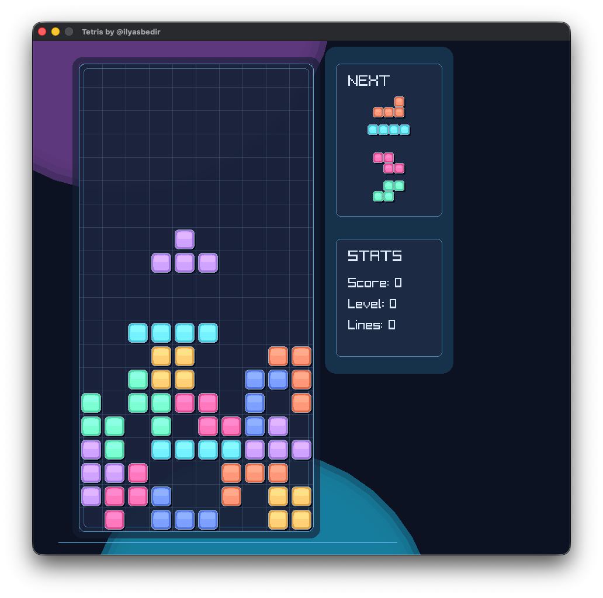

# Tetris (Zig + Raylib)

A small Tetris clone written in Zig with raylib for rendering.



## Features
- Modern Tetris feel: 7-bag generator with SRS-style kicks and hard/soft drop
- Preview queue + scoring/level progression
- Raylib-based rendering with a neon-inspired palette

## Requirements
- Zig 0.15.2 or newer (per `build.zig.zon`)
- Dependencies fetched via Zig's package manager (handled by `build.zig.zon`)

## Build & Run
```bash
zig build --fetch             # grab raylib-zig dependency the first time
zig build run                 # debug build
zig build -Drelease-safe run  # optimized run
```

## Controls
- Arrow Left/Right or A/D: move
- Arrow Up/W/X: rotate clockwise
- Z/Q: rotate counter-clockwise
- Arrow Down/S: soft drop
- Space: hard drop
- P: pause
- R: restart after game over
```

## Releases
- Build optimized: `zig build -Drelease-safe run`
- Tag convention: `vMAJOR.MINOR.PATCH` (see `CHANGELOG.md` for history)

## License
MIT. See `LICENSE`.
